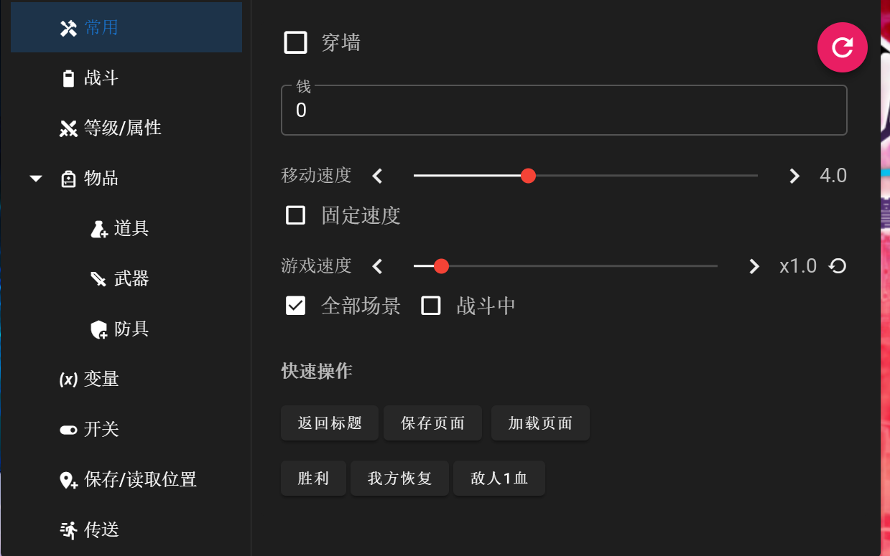
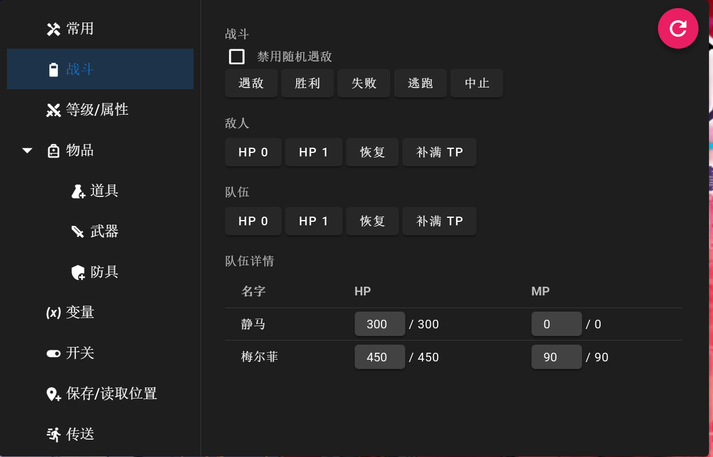

# RPG-Maker-MV-MZ-Cheat-UI-Plugin 插件汉化

本仓库旨在提供[RPG-Maker-MV-MZ-Cheat-UI-Plugin](https://github.com/paramonos/RPG-Maker-MV-MZ-Cheat-UI-Plugin)的中文汉化版本

常用功能：

- 修改角色属性、金钱、物品、变量、开关等
- 修改游戏速度 (x0.1 ~ x10)
- 传送，保存位置，穿墙
- 强制战斗胜利/失败
- 强制保存/读档

有关原仓库的更多信息，请访问 [paramonos/RPG-Maker-MV-MZ-Cheat-UI-Plugin](https://github.com/paramonos/RPG-Maker-MV-MZ-Cheat-UI-Plugin)
